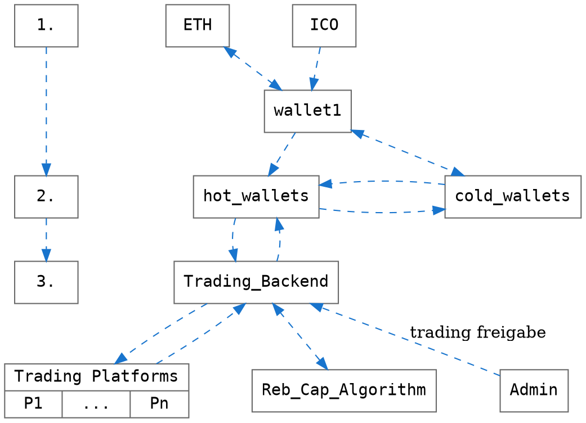
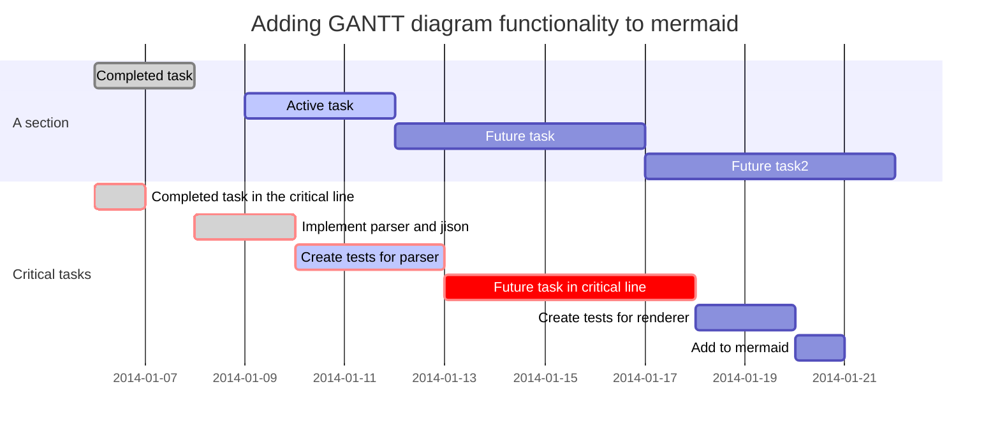
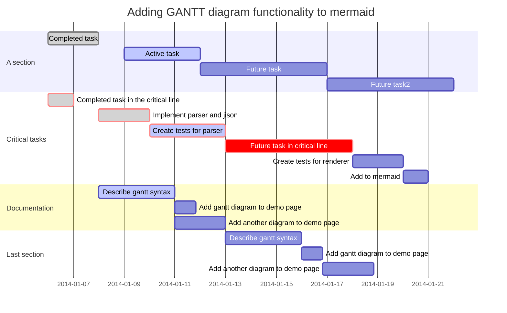

# Funktionale Spezifikation

###

1. User Schnittstelle (Frontend)
    * Bargeldeingang durch Shareholder in Form von ICO's, Cryptowährungen oder Bargeld
    * Bargeldeingang auf zentrales Wallet, danach weiterleitung zu "Hot-" oder "Cold-Wallets"

--> Erstellung ROIC Coins innerhalb ETH ?!

2. Hot- und Cold-Wallets
    * Zur Absicherung gegen Cyberattacken o.ä. werden die Coins dezentral in Verschiedenen Wallets verwahrt.
        * Sicherheitskonzepte
    * Cold Wallets:
        *  genügen höheren Sicherheitsstandarts (evtl offline?), sind aber nicht fürs schnelle traden geeignet,
        *  Hier liegt das meiste Kapital
    * Hot Wallets:
        * Hier liegt nur der Teil des Kapitals, was für das Rebalancing des Portfolios gebraucht wird.
    * Cryptocoin Trading
        * Coins müssen an verschiedenen Trading Plattformen gekauft und verkauft werden, dafür müssen verschiedene Cryptowährungen getauscht werden. Hierbei scheint es bei verschiedenen Plattformen unterschiedliche Wechselkurse zu geben ?!
3. Trading Backend
    * Schnittstelle zu Trading Plattformen
        * [cctx](https://github.com/ccxt/ccxt): 
            * A JavaScript / Python / PHP cryptocurrency trading library with support for more than 100 bitcoin/altcoin exchanges
            * Auf Funktionalität zu prüfen
    * Rebalancing/Capping-Algorithmus gibt die zu tradenden Coins vor
    * Admin erteilt Freigabe fürs Rebalancing, wenn nötig (Regeln sind zu definieren)

### Stichworte
* Kubernetes

## Entwicklung Frontend (Kunde<->ROIC)

## Entwicklung eines Trading-Backends (ROIC<->Cryptomarkt) 

## Sicherheit

## Algorithmische Umsetzung der Trading-Strategie

### Cryptocurrency Index Fond

Bisher implementiert (siehe CIF200: a cryprocurrency index fund):

* passiver CIF mit Rebalancing/Capping-Strategie:

    * statische Anzahl der Coins (200)
    * statisches Rebalancing (14 tägig) 
    * statisches Capping (2%)
    
Weiterer Entwicklungsbedarf:
* dynamische Parameter einführen:
* größere Parameterstudie (adaptive Gridmethoden)

### Gant Chart

    

